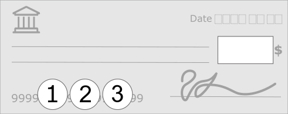

#  svg-illustrations

Generic vectorial illustrations I designed while working on different projects.

## Content overview

<dl>
<dt><a href="device-bezel-templates/"><b>Device bezel templates</b></a></dt>
<dd>

For my latest <a href="https://martindube.net/en/resume" target="_blank">resume &amp; portfolio</a> I used recent devices that are common in 2026 to display mockups within bezels (frames) templates which match the appearance and native dimensions (<code>viewBox</code>) of the other devices in relation to each other. They all have a subtle reflection visible on the piano black bezels. This explains why I needed to duplicate the iPad in both orientation.

 
Macbook Air 15" M4

 
 
Google Pixel 10A / iPhone Air

 

</dd>
<dt><a href="payment-methods/"><b>Payment methods</b></a></dt>
<dd>

Generic placeholders for common payment methods and brands used in Eastern Canada.

 
Specimen of a bank check

 
Unbranded and <i>Interac</i> / <i>MasterCard</i> / <i>VISA</i> branded cards. 
<mark>&#9888;</mark> <i>Do not use all brands on a same card like I did here, this is just to demo the logos already available within the file.</i>

</dd>
<dt><a href="road-signs/"><b>Road signs</b></a></dt>
<dd>

For my personal motorcycle related projects <a href="https://solutionsmoto.ca" target="_blank">SolutionsMoto.ca</a> I designed road signs that I could not find on the internet (at the time).

</dd>
<dt><a href="winery-bottle-placeholders/"><b>Winery placeholders</b></a></dt>
<dd>

I designed those images to allow my friends at <a href="https://vignoble-leblanc.ca" target="_blank">Vignoble Leblanc</a> to use a generic image of a new (comming) wine on their website. At that stage they don't even know for sure what the color will look like before the months of maceration are over and the bottling are done.

</dd>
</dl>
