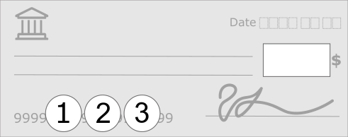
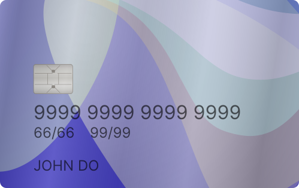
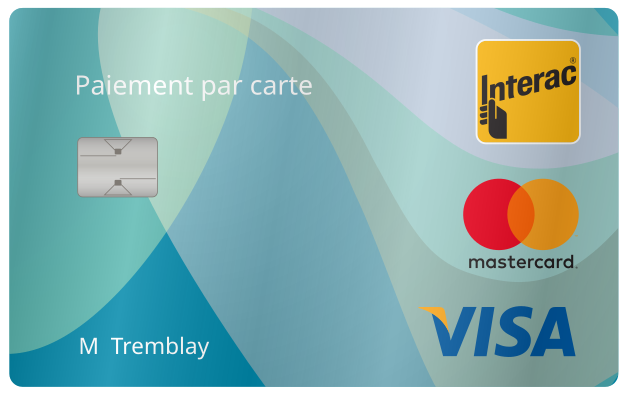
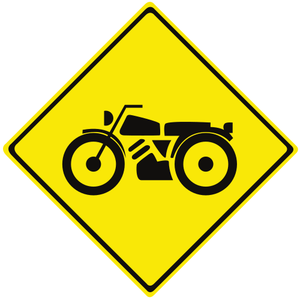
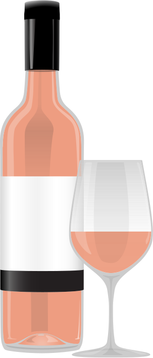

# svg-illustrations

Generic vectorial illustrations I designed while working on different projects.

## Description of my graphic illustrations

1. **Device bezel templates:** For my 2026 portfolio I used recent common devices to display mockups within bezels (frames) that match graphic styles from one device to the other.
1. **Payement methods:** Generic placeholders for credit card brands and _Interac_ cards
1. **Road signs:** For my personnal motorcycle related projet [SolutionsMoto.ca](https://solutionsmoto.ca) I designed road signes that I could not find on the internet (at the time).
1. **Winery placeholders:** I designed those images to allow my friends at [Vignoble Leblanc](https://vignoble-leblanc.ca) to use a generic image of a new (comming) wine on their website. At that stage they don't even know for sure what the color will look like before the months of maceration are over and the bottling are done.

&nbsp;

----

&nbsp;

<dl>
<dt><a href="device-bezel-templates/"><b>Device bezel templates</b></a></dt>
<dd>

 

 

</dd>
<dt><a href="payment-methods/"><b>Payement methods</b></a></dt>
<dd>
 

</dd>
<dt><a href="road-signs/"><b>Road signs</b></a></dt>
<dd>

</li>

</dd>
<dt><a href="winery-bottle-placeholders/"><b>Winery placeholders</b></a></dt>
<dd>

</dd>
</dl>
